# Home Cybersecurity Lab — Attack, Detect and Harden

A hands-on cybersecurity lab using VirtualBox, Kali Linux and Ubuntu Server to identify exposed services, analyse network traffic, and harden a Linux server.

## Objective

The objective of this project was to build an isolated cybersecurity lab using Kali Linux as the assessment machine and Ubuntu Server as the target. I used Nmap to identify exposed services, Wireshark to analyse the traffic generated by scanning, and then hardened the Ubuntu server with SSH configuration, UFW firewall rules and removal of an unnecessary FTP service.

## Lab Setup

| VM | OS | Role | IP Address |
|----|----|------|------------|
| Kali Linux | Kali Linux 2026.2 | Assessment (attacker) machine | `10.0.5.3` |
| Ubuntu-Target | Ubuntu Server 24.04.5 LTS | Target server | `10.0.5.5` |

Both VMs run in VirtualBox on a private **LabNet** NAT network (`10.0.5.0/24`, DHCP enabled).

### S1 — Virtualization enabled
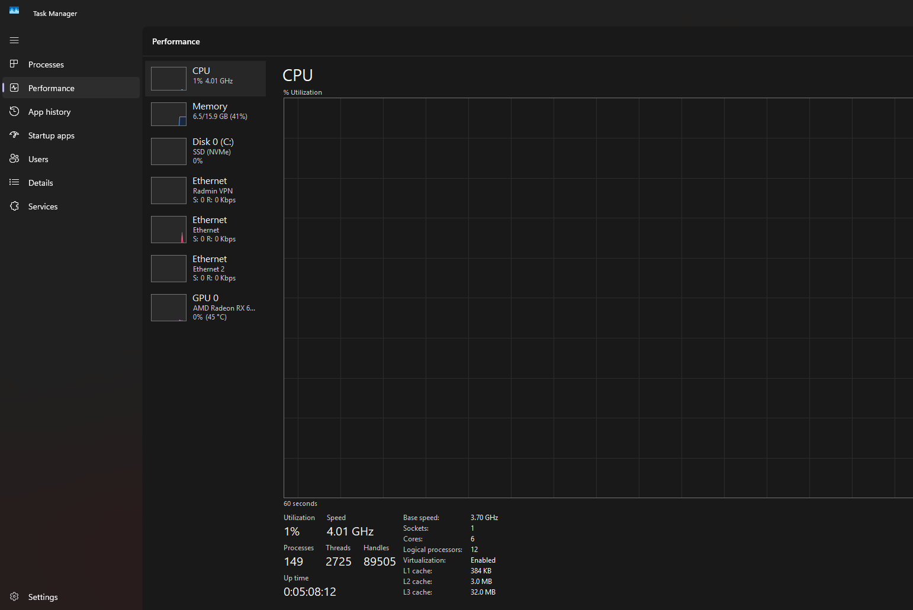

Task Manager shows **Virtualization: Enabled**. Hardware virtualization is required for VirtualBox to run both lab VMs, and it is the foundation of a safe, isolated testing environment.

### S2 — LabNet NAT network
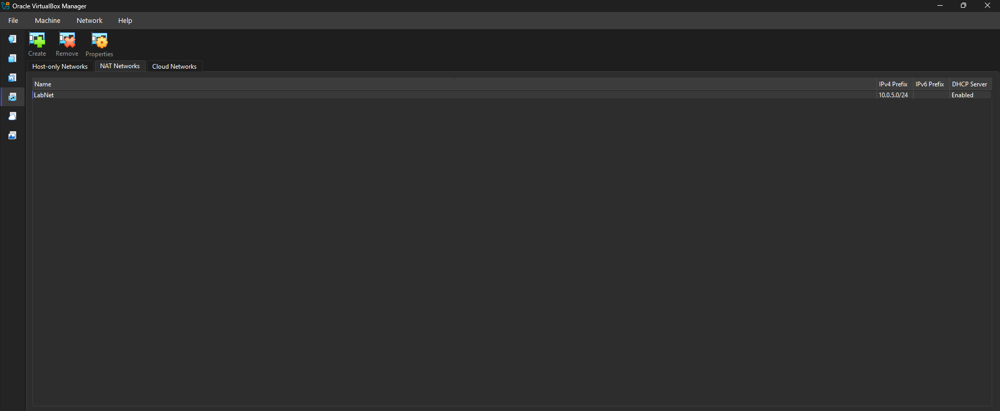

VirtualBox's NAT Networks tab shows **LabNet** with prefix `10.0.5.0/24` and the DHCP server enabled. It is the private network connecting Kali and Ubuntu, so all testing stays inside the lab.

### S3 — Kali IP address
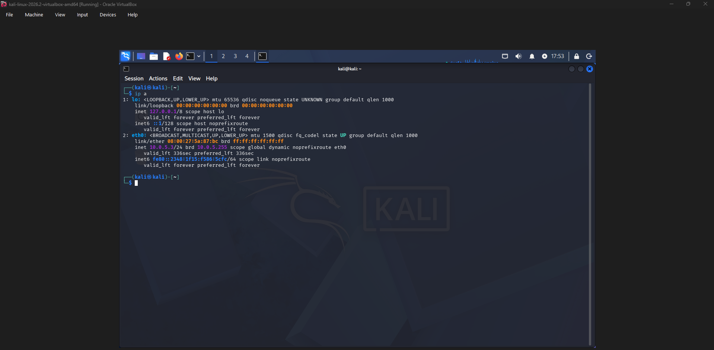

`ip a` on Kali shows `eth0` with address **10.0.5.3/24**. Kali is the assessment machine that runs Nmap and Wireshark.

### S4 — Ubuntu Server IP address
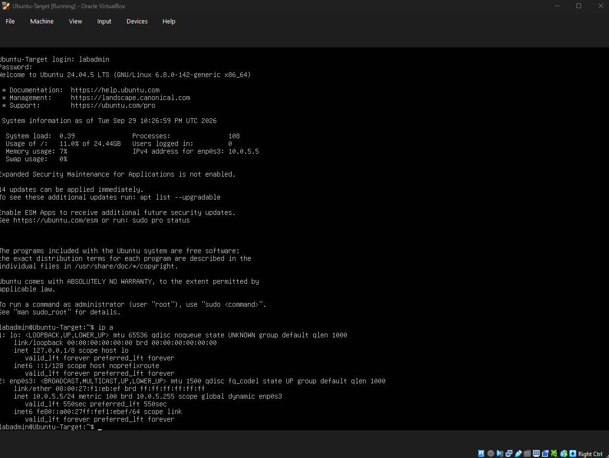

After logging in to Ubuntu-Target, `ip a` shows `enp0s3` with address **10.0.5.5/24**. This is the server being assessed and hardened.

### S5 — Connectivity test
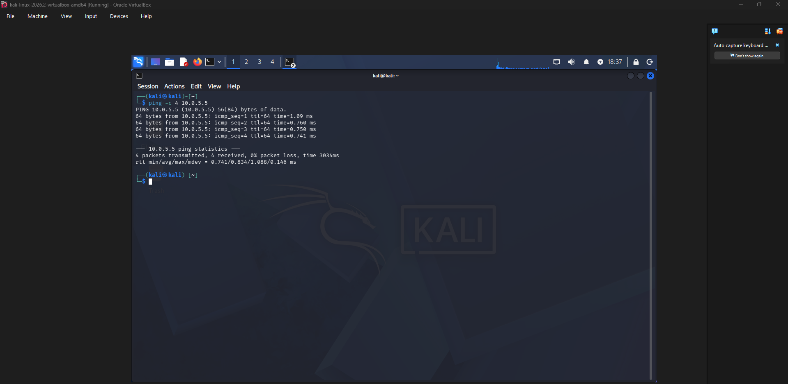

`ping -c 4 10.0.5.5` from Kali returned 4 of 4 replies with 0% packet loss. This confirms the VMs can talk to each other, so later scan results reflect the server's real exposure and not a network fault.

## Method

Build the isolated network → configure Kali and Ubuntu → list listening services → run the first Nmap scan → capture it in Wireshark → harden SSH and the firewall → remove FTP → run the second Nmap scan → compare the results.

## Findings Before Hardening

The initial scan identified TCP ports **21 (FTP / vsftpd 3.0.5)**, **22 (SSH / OpenSSH 9.6p1)** and **80 (HTTP / Apache 2.4.58)** as open.

### S6 — Listening services on the server
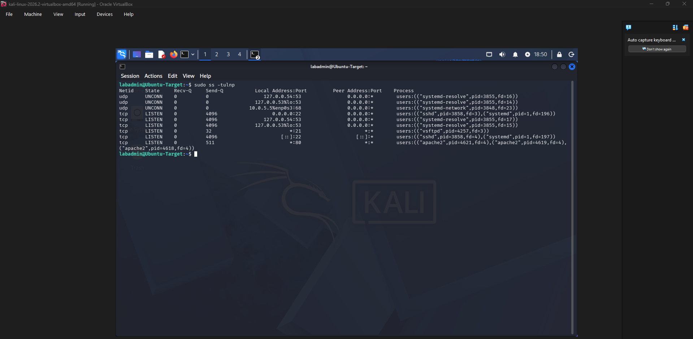

`sudo ss -tulnp` on Ubuntu shows `vsftpd` on port 21, `sshd` on port 22 and `apache2` on port 80 listening on all interfaces (the other entries are the local DNS resolver and DHCP client). This is the server's baseline exposure seen from the inside. FTP is the riskiest of the three because it is unencrypted and not needed in this lab.

### S7 — Nmap scan before hardening
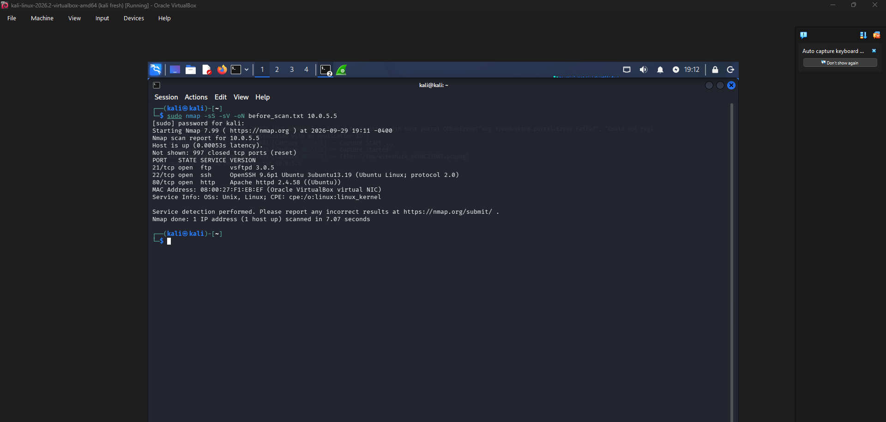

I ran `sudo nmap -sS -sV -oN before_scan.txt 10.0.5.5` from Kali. Nmap reported 3 open ports (21, 22, 80) with service and version details, and 997 closed ports that answered with a reset. It matches S6, which shows an outside attacker can see what the server is running. Version details help an attacker look up known vulnerabilities.

### S8 — Wireshark SYN traffic
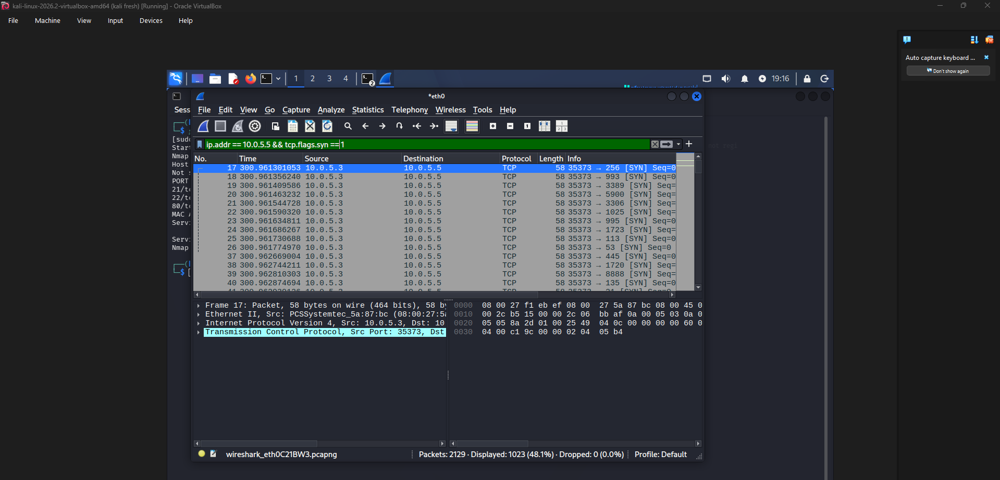

Filtering on `ip.addr == 10.0.5.5 && tcp.flags.syn == 1` shows a rapid burst of SYN packets from `10.0.5.3` to many different destination ports (256, 993, 3389, 5900, 3306 and more) in a fraction of a second. Of 2,129 captured packets, 1,023 matched the filter. A single source hitting many ports this fast is the signature of a SYN scan.

### S9 — SYN-ACK and RST responses
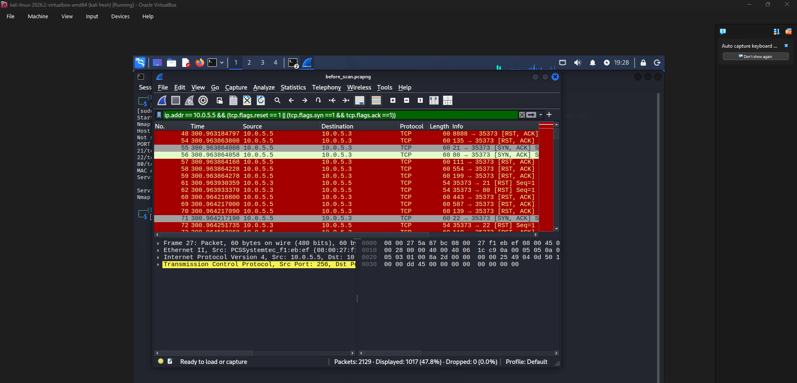

Opened from the saved `before_scan.pcapng`, with a filter for reset or SYN-ACK replies. The server answered ports **21, 22 and 80** with `[SYN, ACK]` (open) and nearly every other port with `[RST, ACK]` (closed). Kali then sent `[RST]` back to ports 21, 80 and 22 instead of completing the handshake, which is why a SYN scan is called "half-open". This difference in replies is how Nmap tells open ports from closed ones.

## Hardening Actions

- **SSH key authentication** configured (ed25519 key).
- **Root SSH login disabled** and **password authentication disabled**.
- **UFW** enabled with default-deny incoming, allowing only SSH (22/tcp) and HTTP (80/tcp).
- **vsftpd (FTP)** stopped, disabled and purged.

> Note: the VirtualBox title bar in S10, S12 and S13 reads "Ubuntu-Target (before hardening)". That is just the name of the VM snapshot I was working from. The terminal output shows the hardening changes applied.

### S10 — UFW firewall
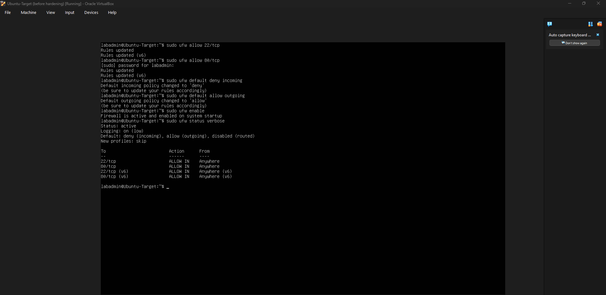

I allowed `22/tcp` and `80/tcp`, set the default incoming policy to deny and outgoing to allow, then enabled UFW. `sudo ufw status verbose` confirms **Status: active**, `deny (incoming), allow (outgoing)`, and only ports 22 and 80 allowed (IPv4 and IPv6). Everything not explicitly needed is now blocked.

### S11 — SSH key authentication
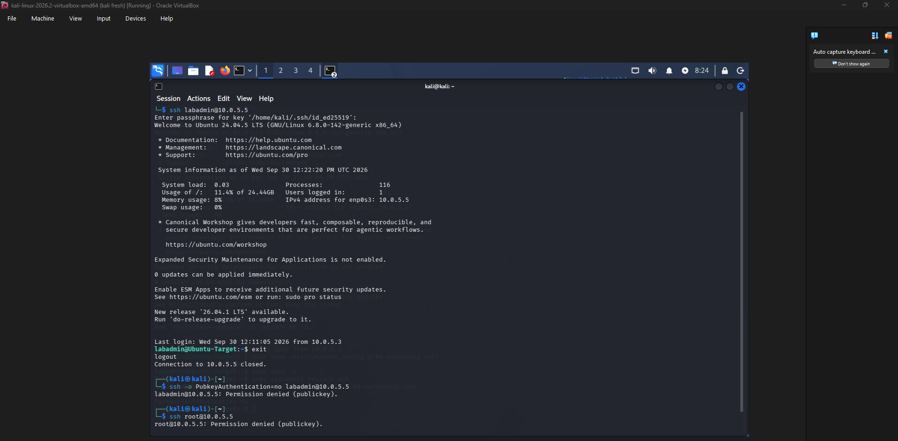

From Kali, `ssh labadmin@10.0.5.5` prompted for my key passphrase and logged in successfully. Forcing password login with `-o PubkeyAuthentication=no` returned `Permission denied (publickey)`, and `ssh root@10.0.5.5` was also denied. So only the key holder can log in, and guessed or stolen passwords are useless.

### S12 — SSH effective configuration
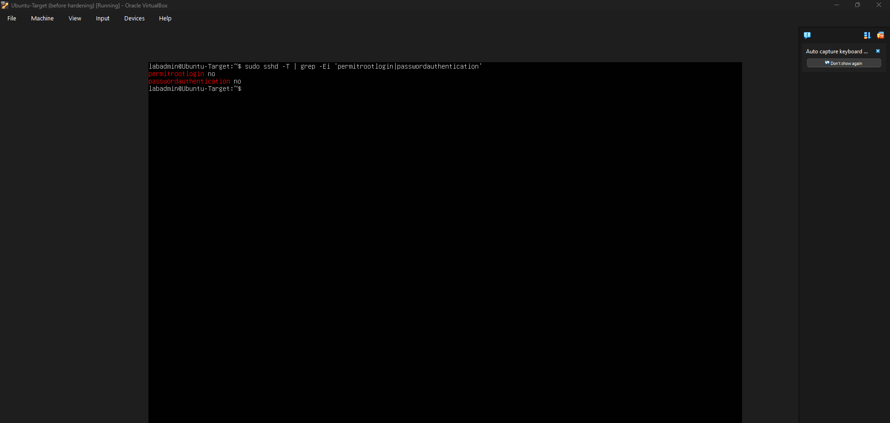

`sudo sshd -T | grep -Ei 'permitrootlogin|passwordauthentication'` returns `permitrootlogin no` and `passwordauthentication no`. This shows the settings actually in force, not just what I typed into the config file.

### S13 — Listening services after hardening
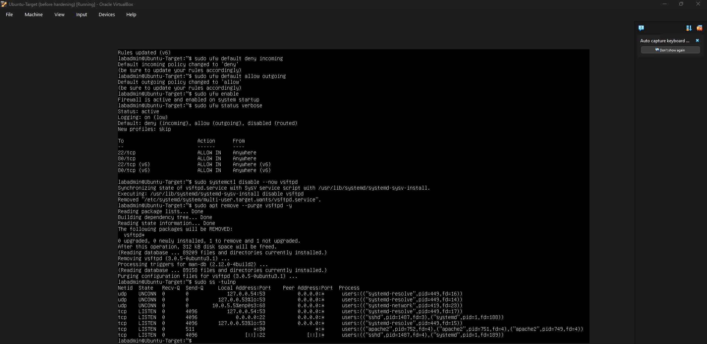

The terminal shows the UFW status, then `systemctl disable --now vsftpd` and `apt remove --purge vsftpd -y` removing the FTP server. The final `sudo ss -tulnp` no longer lists port 21. Only `sshd` (22) and `apache2` (80) remain as network-facing services, plus the local DNS resolver on loopback and the DHCP client.

## Findings After Hardening

The second scan showed only ports **22** and **80** open, with the other 998 scanned ports **filtered**.

### S14 — Nmap scan after hardening
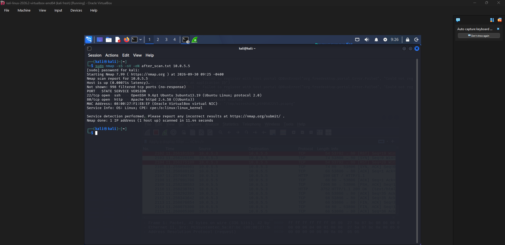

I re-ran `sudo nmap -sS -sV -oN after_scan.txt 10.0.5.5`. Only SSH (OpenSSH 9.6p1) and HTTP (Apache 2.4.58) are open. `998 filtered tcp ports (no-response)` means UFW now silently drops probes instead of replying with a reset, so an attacker learns much less about the server.

### S15 — Before and after comparison
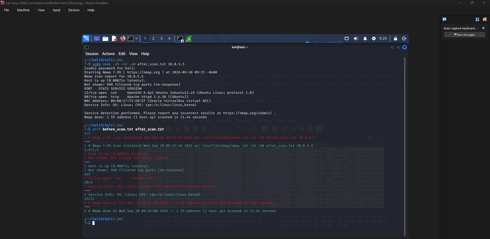

`diff before_scan.txt after_scan.txt` highlights exactly what changed:

| | Before | After |
|---|--------|-------|
| FTP (21) | Open (vsftpd 3.0.5) | Removed |
| SSH (22) | Open | Open, key-only |
| HTTP (80) | Open | Open |
| Other ports | 997 closed (reset) | 998 filtered (no response) |
| Scan duration | 7.07 s | 11.44 s |

The scan took longer afterwards because Nmap had to wait on filtered ports that never replied. That is a side benefit of dropping traffic instead of answering it.

## What I Learned

**Open, closed and filtered ports.** Before hardening, my Nmap scan showed 3 open ports and 997 closed ports that replied with a reset (S7). After hardening, 998 ports showed as filtered because the firewall dropped the traffic without replying (S14). I learned that "closed" means the host answered with a reset, while "filtered" means there was no response at all.

**How a SYN scan looks in Wireshark.** In S8 I saw one source sending SYN packets to many ports in a fraction of a second. In S9, open ports answered with SYN-ACK and closed ports answered with RST. Kali then sent a reset instead of finishing the handshake, which is why it's called a half-open scan.

**Why a firewall matters.** UFW with a default-deny policy meant only the ports I allowed (22 and 80) were reachable. The scan also took longer afterwards (7.07 s to 11.44 s, S15) because Nmap had to wait on ports that never answered.

**Why fewer services means less risk.** FTP was running but not needed, and it sends data unencrypted. Removing vsftpd (S13) took away a whole service an attacker could target. Every service I don't run is one less thing to secure and patch.

**Stronger access control.** Switching SSH to key-only login and disabling root login (S11, S12) means a guessed or stolen password can't be used to get in. I tested this by trying to log in with a password and as root, and both were denied.

**What I would do next.** I would add fail2ban to block repeated login attempts, restrict SSH to specific source IPs, and keep the server updated, since the login screen showed updates waiting.

## Ethics Note

All security testing in this project was performed against virtual machines that I created and controlled in an isolated lab environment. No external systems, websites or networks were scanned.
